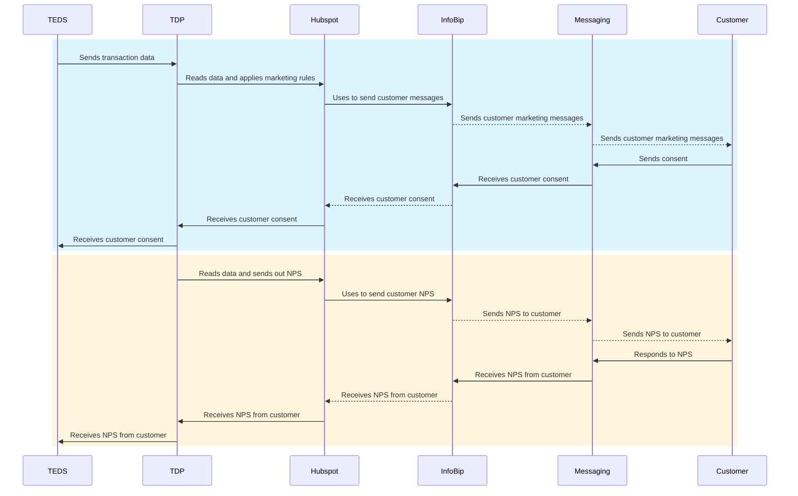

## CRM Workflow

```mermaid
sequenceDiagram
    participant TEDS
    participant TDP
    participant Hubspot
    participant InfoBip
    participant Messaging
    participant Customer
    rect rgb(220, 245, 255)
        TEDS->>TDP: Sends transaction data
        TDP->>Hubspot: Reads data and applies marketing rules
        Hubspot->>InfoBip: Uses to send customer messages
        InfoBip-->>Messaging: Sends customer marketing messages
        Messaging-->>Customer: Sends customer marketing messages
        Customer->>Messaging: Sends consent
        Messaging->>InfoBip: Receives customer consent
        InfoBip-->>Hubspot: Receives customer consent
        Hubspot->>TDP: Receives customer consent
        TDP->>TEDS: Receives customer consent
    end

    rect rgb(255, 245, 220)
        TDP->>Hubspot: Reads data and sends out NPS
        Hubspot->>InfoBip: Uses to send customer NPS
        InfoBip-->>Messaging: Sends NPS to customer
        Messaging-->>Customer: Sends NPS to customer
        Customer->>Messaging: Responds to NPS
        Messaging->>InfoBip: Receives NPS from customer
        InfoBip-->>Hubspot: Receives NPS from customer
        Hubspot->>TDP: Receives NPS from customer
        TDP->>TEDS: Receives NPS from customer
    end
```